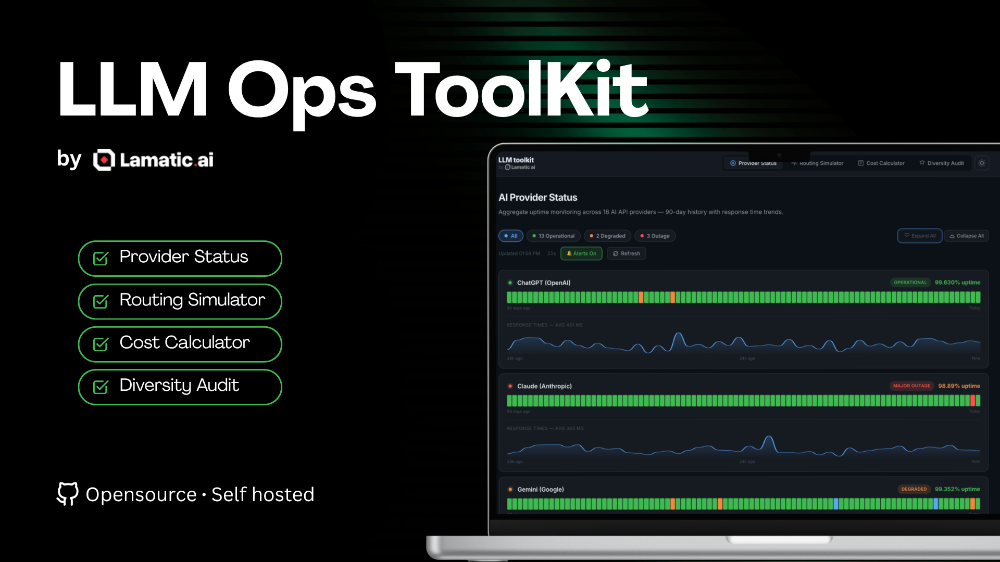

<div align="center">
  
</div>

<div align="center">

[](https://developers.cloudflare.com/pages/)
[](LICENSE)
[](CONTRIBUTING.md)
[](https://lamatic.ai)

</div>

---

# LLM Ops Toolkit

A free, open-source dashboard for AI engineering teams — real-time provider uptime monitoring, TCO cost calculator, routing simulator, and model diversity audit. All in a single static page with zero dependencies.

## Features

- 🟢 **Provider Status Monitor** — Aggregate uptime across 18+ AI API providers with 90-day history and live response-time sparklines
- 💰 **Cost Calculator** — True cost analysis including hidden engineering overhead and routing savings
- 🔀 **Routing Simulator** — Visualise intelligent request distribution across models with cost/quality trade-offs
- 📊 **Diversity Audit** — 10-question maturity assessment with radar chart and personalised recommendations
- 🌙 **Dark/Light mode**, auto-refresh, browser notifications for outages, and a dynamic favicon that mirrors overall provider health

## Quick Start (Self-Hosting)

The toolkit is a single `index.html` + `app.js` + `style.css`. No build step, no server-side code.

### Option 1 — Open locally

```bash
git clone https://github.com/Lamatic/llm-ops-toolkit.git
cd llm-ops-toolkit
# Open index.html in your browser (or serve with any static server)
npx serve .
```

### Option 2 — Deploy to Cloudflare Pages (free)

```bash
git clone https://github.com/Lamatic/llm-ops-toolkit.git
cd llm-ops-toolkit

# Install Wrangler CLI
npm install -g wrangler

# Authenticate
wrangler login

# Deploy
wrangler pages deploy . --project-name llm-ops-toolkit
```

### Option 3 — Deploy to Vercel / Netlify

Drag-and-drop the repository folder onto [vercel.com/new](https://vercel.com/new) or [app.netlify.com](https://app.netlify.com). No configuration required.

### Option 4 — GitHub Pages

1. Fork this repository
2. Go to **Settings → Pages**
3. Set source to `main` branch, `/ (root)` folder
4. Your toolkit will be live at `https://<your-username>.github.io/llm-ops-toolkit`

## Project Structure

```
llm-ops-toolkit/
├── index.html        # Main HTML — layout, tabs, meta tags
├── app.js            # All application logic (tabs, charts, simulator, status)
├── style.css         # Dark/light theme stylesheet
├── cover.png         # Cover image (used in README and OG meta)
├── og-image.svg      # Fallback OG social-share image
├── wrangler.jsonc    # Cloudflare Workers/Pages config
├── README.md
└── CONTRIBUTING.md
```

## Contributing

We welcome contributions! Please read [CONTRIBUTING.md](CONTRIBUTING.md) to get started.

## License

MIT © [Lamatic.ai](https://lamatic.ai)
